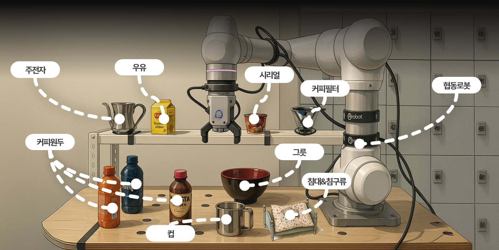

  
  
  

# MyJarvice (Implementation of a Collaborative Robot Work Assistant Based on AI (Computer Vision))  

**Jarvis, the smart AI robot that handles the busy modern person's morning routine** **from Doosan Robotics Rokey Bootcamp3 in 2025**

---

## 🗂️ Overview
This project is designed to assist busy and tired modern individuals with their morning routines by providing breakfast, bed arrangement, and LLM-based services. For breakfast, it prepares coffee and cereal. For bed arrangement, it returns the blanket and pillow to their original positions. The LLM service provides weather updates and music recommendations based on the weather. Additionally, an exception-handling function was implemented to respond to unexpected situations.

---

## 🛠️ Equipment and Materials Used

- Doosan Collaborative Robot M0609  
- ROS2 Humble + Ubuntu 22.04

---
## 🧠 Assumptions for Scenario
1. Coffee beans for brewing drip coffee are assumed to be stored in a coffee can.
2. Due to constraints, the opening and closing of the cereal and milk containers are assumed to be done automatically.
3. The M0609 workbench is assumed to serve as both a cooking area and a bedroom.
---

## 📖 Scenario

1. The LLM model is activated and voice recognition is performed using the wake-up phrase "Hey Jarvis."
2. At this stage, the user can choose the flavor of the coffee (bitter, nutty, or caramel) and the type of cereal (Chex Choco or Corn Frost).
3. Coffee and cereal are prepared according to the given commands.
4. After that, bed arrangement is carried out.
---

## 🎥 Demo Video

  

---

## 📄 Documentation

For a detailed explanation of this project, please refer to the following document:

👉 [doc/F-2_협동2_김도엽_이재호_이한용_손지훈.pdf](docs/F-2_협동2_김도엽_이재호_이한용_손지훈.pdf)

---

## 👥 Contributors

Thanks to these wonderful people who have contributed to this project:

<table>
  <tr>
    <td align="center">
      <a href="https://github.com/kimdoyub">
         
        <b>kimdoyub</b>
      </a>
    </td>
    <td align="center">
      <a href="https://github.com/SmiteLims">
         
        <b>SmiteLims</b>
      </a>
    </td>
    <td align="center">
      <a href="https://github.com/machyong">
         
        <b>machyong</b>
      </a>
    </td>
    <td align="center">
      <a href="https://github.com/jihoonindices">
         
        <b>jihoonindices</b>
      </a>
    </td>
  </tr>
</table>

---

